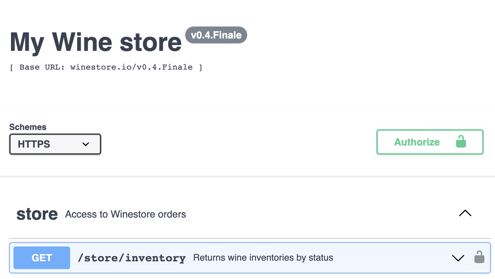
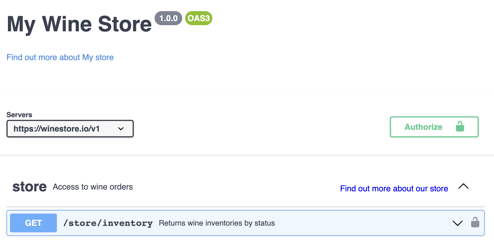

Note:

- interlocuteur 1 : arrive avec sa lib de vin
- interlocuteur 2 : explique la demarche semantic version

 - I1: Salut I2, comment tu va ? dis donc, je voudrais te presenter un truc sur lequel je bosse
 - I2: Ouais, ca va bien, bah ecoute montre moi ca.

<!--h-->
<!-- .slide: data-auto-animate -->
## Mon magasin de Vin



Note: Discussion autour d'une librairie d'étiquette de bouteille vente de vin :

- I1: a besoin de communiquer sa lib au public, a besoin de la diffuser au consommateur
- I1: demande l'avis de I2 concernant sa lib
- I2: argumenter sur la maintenabilité, la facon de gérer les versions et l'exposition
- I2: proposer l'approche Semantic version

<!--v-->

<!-- .slide: data-auto-animate -->
## Mon magasin de Vin

```xml[|5]
<project>
    <modelVersion>4.0.0</modelVersion>
    <groupId>com.wine.information</groupId>
    <artifactId>wineLabel</artifactId>
    <version>v0.4.Finale</version>
</project>
```

Note: Discussion autour d'une librairie d'étiquette de bouteille vente de vin :

- I1: a besoin de communiquer sa lib au public, a besoin de la diffuser au consommateur
- I1: demande l'avis de I2 concernant sa lib
- I2: argumenter sur la maintenabilité, la facon de gérer les versions et l'exposition
- I2: proposer l'approche Semantic version

<!--h-->

## La démarche Semantic Version

C'est quoi ?


Note: 

- I2: c'est la normalisation de la gestion des versions
- I1: Ouh lala, est-ce que ce n'est pas une grosse usine à gaz ton truc ?
- I2: non, tu vas voir c'est hyper simple et surtout, tu ne te prendras plus la tête avec tes prochaines releases
- I1: Mouais... j'y crois pas trop ton truc, moi je crois que tu va me faire perdre mon temps avec tes conneries là
- I2: non... non t'inquiète paupiette, il y a juste quelques petites règles à suivre, mais tu va voir tu va adorer

<!--v-->

## 1ere regle : La plus simple de toute

```xml
<version>v0.4.Finale</version>
```

```text
x.y.z
^ ^ ^
║ ║ ╚═ Réparatation (patch)
║ ╚═══ Fonctionnalités (minor)
╚═════ Gros Truc (major)
```

Note:

- I2: Tu vois normalement les versions, on ne les gère pas comme dans ton bazar
- I1: Hey, mais c'est de mon code que tu parles là ?!
- I2: premiere règle on ne met de lettres dans les versions
- I1: Bah, j'ai déjà vu plein de paquet avec le v devant
- I2: Ouais, mais ce n'est pas semantic version "compliant" pour ces cas-là, tu peux mettre ce que tu ce que tu veux sur 
tes tags, la version, elle, elle ne comporte que des chiffres non-négatif.
- I2: et chaque chiffre veut signifie quelque chose. 

<!--v-->
<!-- .slide: data-auto-animate -->
## 2eme regle : les Pre-releases

```xml
<version>0.4.0</version>
```

Note:

- I1: Ok le v effectivement, tu le mètres à la trappe, jm'en tape
- I1: Et le Final, ok, tu as mis un zero, si ça te fait plaisir...
- I2: Ok, mais c'est pas finit !
- I2: Là ta release, elle n'est pas vraiment release, ce n'est pas une version que tu peux donner aux autres
- I1: Oh bah si, pourquoi je peut pas ?
- I2: Bah normalement, il faut que ta première release commence par la version 1.0.0.
- I2: et c'est uniquement à partir de la version 1.0.0 que tu dois la communiquer
- I2: avant la version 1.0.0, tu peux faire ce que tu veux avec, tu ne dois pas de la publier
- I2: 0.4.0, ça veut dire qu'elle n'est pas stable

<!--v-->

<!-- .slide: data-auto-animate -->
## 2eme regle : les Pre-releases

```xml
<version>0.4.0-alpha</version>
```

Note:

- I2: tu vois par exemple, tu pourrais lui ajouter un identifiant de pre-release, qui permet d'identifier son stade de
développement.
- I1: ouais, mais là, ça ne me va pas là, ma lib est bonne pour être communiquée
- I2: ok... ok, alors dans ce cas, elle doit partir avec une vraie release

<!--v-->

## 3eme regle : La release, la vraie...

```xml
<version>1.0.0</version>
```

Note:

- I2: voilà, donc là si elle part, elle part en version 1.0.0
- I1: ah bah là du coup, là ça me va mieux
- I2: tu m'étonnes, c'est plus propre
- I2: mais du coup, il faut que je t'explique comment ça fonctionne par la suite

<!--v-->

<!-- .slide: data-auto-animate -->
## 4eme regle : les versions suivantes

```xml
<version>1.0.0</version>
```

Note:

- I2: si demain tu as un correctif retro-compatible, bah tu incrémente la version "patch"

<!--v-->

<!-- .slide: data-auto-animate -->
## 4eme regle : les versions suivantes

```xml
<version>1.0.1</version>
```

Note:

- I2: et si demain tu as une nouvelle fonctionnalité retro-compatible, bah tu incrémente la version "mineur"
- I2: et surtout, tu n'oublies pas de remettre à zéro la version "patch"

<!--v-->

<!-- .slide: data-auto-animate -->
## 4eme regle : les versions suivantes

```xml
<version>1.1.0</version>
```

Note:

- I2: et pareille pour n'importe quel autre modification non retro-compatible, tu incrémente la version "majeur"
- I2: et surtout, tu n'oublies pas de remettre à zéro la version "patch" et la version "mineur"

<!--v-->

<!-- .slide: data-auto-animate -->
## 4eme regle : les versions suivantes

```xml
<version>2.0.0</version>
```

Note:

- I1: ouais, bon la dit donc, tu m'avais vendu du rêve, c'est quand même pas ouf comme système
- I1: surtout que, je dois me taper tous les poms comme ca...
- I2: ouais, ouais, t'inquiète, je t'explique juste les règles comme ça, mais j'ai un petit outil qui fait le taff pour 
toi

<!--h-->

## Semantic Release : c'est de l'or en barre

📦🚀 semantic-release

```text
verb(scope): message

notes
```
```text
fix(security): fix security check
```
```text
feat(security): add security standard
```
```text
feat(security): new security standard

BREAKING CHANGES: don't support old security standard
```

Note:

- I2: le principe de base de cet outil, c'est d'analyser tes commits et de créer une release en fonction des messages
- I1: ah, c'est pas mal ça, donc je pourrais gérer toutes mes releases avec ce truc ?
- I2: en principe, oui, tu pourrais te concentrer sur ton dev tout en conservant les règles du semVer.
- I1: ah, mais attend, est-ce qu'on pourrait y ajouter une release note et une note de changelog en passant
- I2: bah en faite, c'est déjà fait pour être franc

<!--v-->
<!-- .slide: data-auto-animate -->
### Comment on le configure

```json[|2|3|4-11|6,9]
{
  "branches": ["main"],
  "tagFormat": "v${version}",
  "plugins": [
    "@semantic-release/commit-analyzer",
    "@semantic-release/exec",
    "@semantic-release/release-notes-generator",
    "@semantic-release/changelog",
    "@semantic-release/git",
    "@semantic-release/github"
  ]
}
```

Note: 

- I2: on y ajoute ta ou tes branches de release
- I2: le format des tags que souhaite (tu peux y ajouter ton `v` si tu veux)
- I2: et pour finir, les different fonctionnalités que tu veux lors de ta releases (details)
- I1: mouais... ok, c'est bien, mais comment je peux y ajouter les fichiers que je souhaite lors de mes release ?
- I1: genre, comment je fais pour eviler de me taper tous mes poms a la chaine pour chaque release ?
- I2: attend, ce n'est pas fini

<!--v-->

<!-- .slide: data-auto-animate -->
### Pour bien commencer

```json
["@semantic-release/exec", {
  "prepareCmd": "VERSION=${nextRelease.version} make exec-release"
}]
```
```makefile
exec-release: ## Execution of a new release
    ./mvnw -q versions:set -DnewVersion=${VERSION}
    sed -Ei 's/version:.*/version: ${VERSION}/g' openapi.yaml
```
```json
["@semantic-release/git", {
  "assets": ["CHANGELOG.md", "pom.xml", "openapi.yaml"],
  "message": "chore(release): version ${nextRelease.version}"
}]
```

Note: 

- I2: pour tes poms, il suffit de rajouter la petite commande qui va bien
- I2: et pour tes fichiers, on les ajoute avec un message de commit
- I2: pour example ton swagger

<!--v-->

<!-- .slide: data-auto-animate -->
### Pour bien commencer




<!--v-->

<!-- .slide: data-auto-animate -->
### testons tout ca

```shell
npx semantic-release
```
demo !

Note: 

- I2: (fait la demo)
- I1: ton outil semble magique, mais si je dois le lancer à chaque fois à la main, je sens que cela va me gaver
- I2: mais non là, c'est pour tester en locale mais on intègre tout cela dans Github - Actions et il te fera le café,
  regarde mon beau repo ...(presenter la CI GH et l'action en live)
- I1: Ok donc si j’ai bien compris, j’ajoute 10 lignes dans ma Github Actions et c'est marre
- I1: Je code et commit avec des fix feat et Breaking Changes et tout sera fait tout seul, c’est bien cela ?
- I2: T’as tout compris mon bichon
- I2: et meme maintenant, je peux meme te montrer des petites astuces pour pas se gourer


<!--v-->

<!-- .slide: data-auto-animate -->
### Pour après - gestion des pre-release

on peut aussi gérer les pre-release !

```json
{
  "branches": [
    "main",
    {
      "name": "pre-*",
      "prerelease": true
    }
  ]
}
```

Note:

- I2: Après tout ça, on peut aussi rajouter la gestion des pre-release
- I1: ah oui, cool, en faite, je pourrais appliquer ça à mon cas présent de version
- I2: en effet, semantic-release

<!--v-->

<!-- .slide: data-auto-animate -->
### Pour après - l'ordre des plugins est important

l'ordre des plugins est important

```json
{
  "branches": ["main"],
  "tagFormat": "${version}",
  "plugins": [
    "@semantic-release/commit-analyzer",
    "@semantic-release/exec",
    "@semantic-release/release-notes-generator",
    "@semantic-release/git",
    "@semantic-release/changelog",
    "@semantic-release/github"
  ]
}
```

pas de changelog, pas de chocolat 😢

Note:

- I2: par contre, fait bien gaffe à ne pas te planter, ça parait tout con, mais certains s'y sont cassé les dents

<!--v-->

<!-- .slide: data-auto-animate -->
### Pour après - les étapes

Les différentes étapes de release

- `verifyConditions`
- `analyzeCommits`
- `verifyRelease`
- `generateNotes`
- `prepare`
- `publish`
- `addChannel`
- `success`
- `fail`

Note: 

- I2: après, il est possible d'y ajouter d'autres étapes dans semantic release, ils ont tout prévu...
- I1: Ok ben pour moi, c'est clair, (se tourne vers l’assistance) et vous ? avez-vous des questions ?

https://github.com/semantic-release/semantic-release/blob/master/docs/developer-guide/plugin.md

<!--h-->

## Merci


Auteurs:
#### s. Lavazais
#### d. Six
